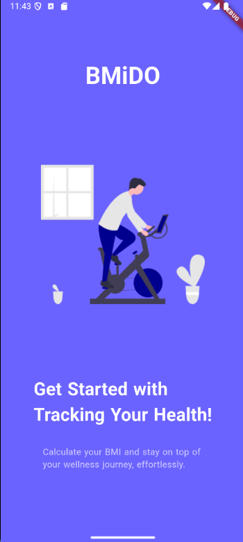
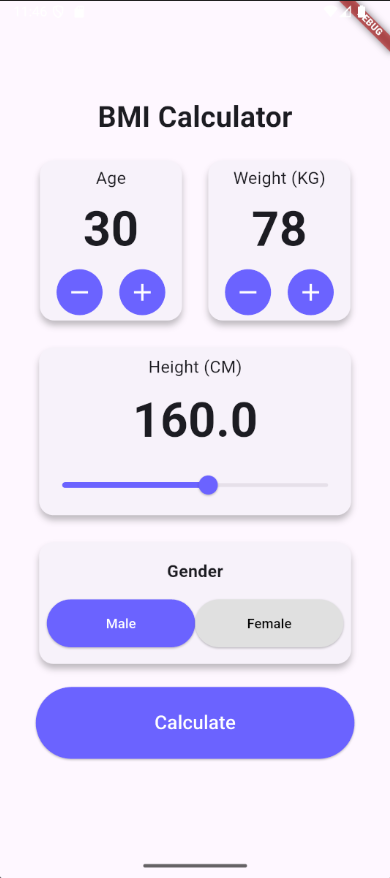

# BMI Calculator

A simple **BMI (Body Mass Index) Calculator** built using **Flutter**. This app allows users to enter their **age, weight, height, and gender** to calculate their BMI and determine their BMI category.

---

## 📌 Features
- **Calculate BMI** based on user input
- **Categorize BMI** as Underweight, Normal, Overweight, or Obese
- **Interactive UI** with toggle buttons for gender selection
- **Dynamic result screen** displaying BMI value and category

---

## 📷 Screenshots
| Splash Screen | Home Screen | Result Screen |
|-------------|-------------|--------------|
|  |  |  |

---

## 🛠️ Technologies Used
- **Flutter** (Dart)
- **Material Design UI Components**

---

## 📥 Installation & Setup
1. **Clone the repository:**
   ```sh
   git clone https://github.com/chirag640/bmi-calculator.git
   cd bmi-calculator
   ```
2. **Install dependencies:**
   ```sh
   flutter pub get
   ```
3. **Run the application:**
   ```sh
   flutter run
   ```

---

## 🧮 BMI Calculation Formula
BMI is calculated using the formula:
```
BMI = weight (kg) / (height (m) * height (m))
```

### **BMI Categories:**
| Category       | BMI Range        |
|--------------|----------------|
| Underweight  | BMI < 18.5      |
| Normal Weight | 18.5 ≤ BMI < 24.9 |
| Overweight   | 25 ≤ BMI < 29.9  |
| Obesity      | BMI ≥ 30        |

---

## 🚀 How It Works
1. Enter **age, weight, and height**.
2. Choose your **gender**.
3. Tap **"Calculate"**.
4. View your **BMI result and category**.
5. Click **"Recalculate"** to enter new values.

---

## 📄 Project Structure
```
└── 📁lib
    └── 📁pages
        └── calculator_page.dart
        └── result_page.dart
        └── splash_screen.dart
    └── main.dart
```

---

## 🤝 Contributing
Contributions are welcome! Feel free to fork this repo and submit a pull request.

---

## 🛡️ License
This project is licensed under the **MIT License**.

---

## 📬 Contact
For any questions or suggestions, feel free to reach out:
📧 Email: [chaudharychirag640@gmail.com](mailto:chaudharychirag640@gmail.com)
📌 GitHub: [chirag640](https://github.com/chirag640)

---

🚀 **Enjoy Coding & Stay Healthy!** 🏋️‍♂️

